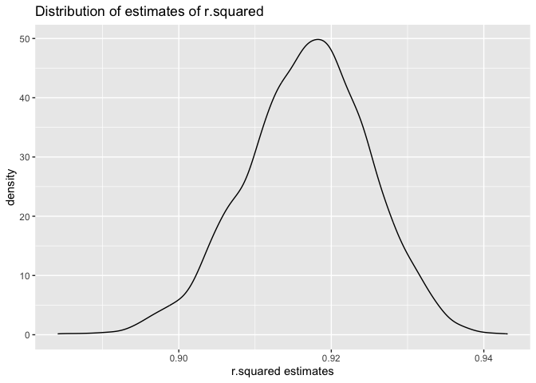
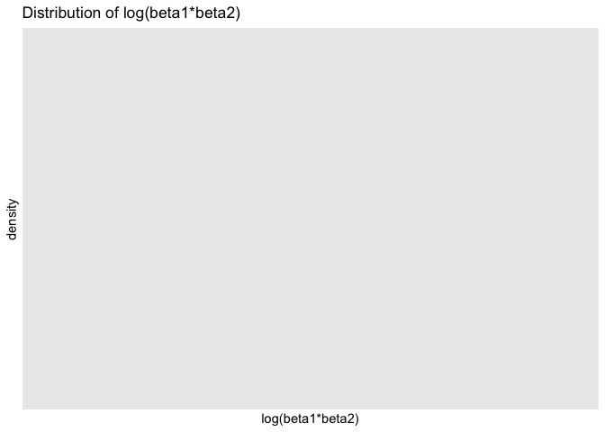
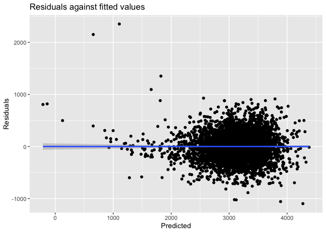
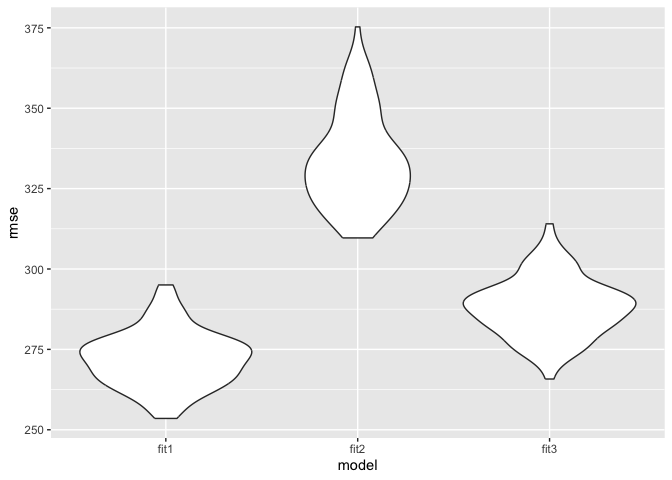

p8105_hw6_ww2745
================
ww2745
2024-11-28

``` r
library(tidyverse)
```

    ## ── Attaching core tidyverse packages ──────────────────────── tidyverse 2.0.0 ──
    ## ✔ dplyr     1.1.4     ✔ readr     2.1.5
    ## ✔ forcats   1.0.0     ✔ stringr   1.5.1
    ## ✔ ggplot2   3.5.1     ✔ tibble    3.2.1
    ## ✔ lubridate 1.9.3     ✔ tidyr     1.3.1
    ## ✔ purrr     1.0.2     
    ## ── Conflicts ────────────────────────────────────────── tidyverse_conflicts() ──
    ## ✖ dplyr::filter() masks stats::filter()
    ## ✖ dplyr::lag()    masks stats::lag()
    ## ℹ Use the conflicted package (<http://conflicted.r-lib.org/>) to force all conflicts to become errors

``` r
library(purrr)
library(ggplot2)
library(MASS)
```

    ## 
    ## Attaching package: 'MASS'
    ## 
    ## The following object is masked from 'package:dplyr':
    ## 
    ##     select

``` r
library(modelr)
set.seed(1)
```

## Problem 1

``` r
weather_df = 
  rnoaa::meteo_pull_monitors(
    c("USW00094728"),
    var = c("PRCP", "TMIN", "TMAX"), 
    date_min = "2017-01-01",
    date_max = "2017-12-31") |> 
  mutate(
    name = recode(id, USW00094728 = "CentralPark_NY"),
    tmin = tmin / 10,
    tmax = tmax / 10) |> 
  dplyr::select(name, id, everything())
```

    ## using cached file: /Users/suzywu/Library/Caches/org.R-project.R/R/rnoaa/noaa_ghcnd/USW00094728.dly

    ## date created (size, mb): 2024-10-29 08:14:14.82217 (8.656)

    ## file min/max dates: 1869-01-01 / 2024-10-31

We’ll focus on a simple linear regression with tmax as the response and
tmin as the predictor, and are interested in the distribution of two
quantities estimated from these data: 𝑟̂ 2 log(𝛽̂ 0∗𝛽̂ 1) Use 5000
bootstrap samples and, for each bootstrap sample, produce estimates of
these two quantities. Plot the distribution of your estimates, and
describe these in words.

``` r
boot_strap = weather_df |>  
  modelr::bootstrap(n = 5000) |> 
  mutate(
    mods = map(strap, ~lm(tmax ~ tmin + prcp, data = .x)),
    mods_beta = map(mods, broom::glance),
    mods_r2 = map(mods, broom::tidy)) |> 
  unnest(mods_r2, mods_beta) |> 
  dplyr::select(.id, term, estimate, r.squared) |>  
  pivot_wider(names_from = term, values_from = estimate) |> 
  rename(
    beta_0 = `(Intercept)`,
    beta_1 = tmin,
    beta_2 = prcp) 
```

    ## Warning: `unnest()` has a new interface. See `?unnest` for details.
    ## ℹ Try `df %>% unnest(c(mods_r2, mods_beta))`, with `mutate()` if needed.

``` r
res = boot_strap  |> 
  summarise(r.squared = r.squared,
    log_beta12 = log(beta_1 * beta_2))
```

    ## Warning: There was 1 warning in `summarise()`.
    ## ℹ In argument: `log_beta12 = log(beta_1 * beta_2)`.
    ## Caused by warning in `log()`:
    ## ! NaNs produced

    ## Warning: Returning more (or less) than 1 row per `summarise()` group was deprecated in
    ## dplyr 1.1.0.
    ## ℹ Please use `reframe()` instead.
    ## ℹ When switching from `summarise()` to `reframe()`, remember that `reframe()`
    ##   always returns an ungrouped data frame and adjust accordingly.
    ## Call `lifecycle::last_lifecycle_warnings()` to see where this warning was
    ## generated.

``` r
res_noNA = res  |> 
  na.omit()

head(res)
```

    ## # A tibble: 6 × 2
    ##   r.squared log_beta12
    ##       <dbl>      <dbl>
    ## 1     0.910        NaN
    ## 2     0.904        NaN
    ## 3     0.924        NaN
    ## 4     0.904        NaN
    ## 5     0.919        NaN
    ## 6     0.923        NaN

``` r
head(res_noNA)
```

    ## # A tibble: 0 × 2
    ## # ℹ 2 variables: r.squared <dbl>, log_beta12 <dbl>

``` r
r2_ci = 
  quantile(pull(res,r.squared), probs = c(0.025,0.975)) |> 
  knitr::kable()

r2_ci_noNA = 
  quantile(pull(res_noNA,r.squared), probs = c(0.025,0.975)) |> 
  knitr::kable()

log_ci = 
  quantile(pull(res_noNA,log_beta12), probs = c(0.025,0.975)) |> 
  knitr::kable()
  
r2_ci
```

|       |         x |
|:------|----------:|
| 2.5%  | 0.8997722 |
| 97.5% | 0.9319671 |

``` r
r2_ci_noNA
```

|       |   x |
|:------|----:|
| 2.5%  |  NA |
| 97.5% |  NA |

``` r
log_ci
```

|       |   x |
|:------|----:|
| 2.5%  |  NA |
| 97.5% |  NA |

``` r
r2_dist = res  |> 
  ggplot(aes(x = r.squared)) +
  geom_density() +
  labs(title = "Distribution of estimates of r.squared", x = "r.squared estimates")

r2_dist
```

<!-- -->

``` r
b1b2_dist = res_noNA |> 
  ggplot(aes(x = log_beta12)) +
  geom_density() +
  labs(title = "Distribution of log(beta1*beta2)", x = "log(beta1*beta2)")

b1b2_dist
```

<!-- -->

## Problem 2

``` r
homicide = 
  read_csv(
    "./data/homicide-data.csv")
```

    ## Rows: 52179 Columns: 12
    ## ── Column specification ────────────────────────────────────────────────────────
    ## Delimiter: ","
    ## chr (9): uid, victim_last, victim_first, victim_race, victim_age, victim_sex...
    ## dbl (3): reported_date, lat, lon
    ## 
    ## ℹ Use `spec()` to retrieve the full column specification for this data.
    ## ℹ Specify the column types or set `show_col_types = FALSE` to quiet this message.

``` r
cleaned_homicide_data = homicide |> 
  mutate(city_state = paste(city, state, sep = ", "))  |> 
  mutate(solved_binary = ifelse(disposition == "Closed by arrest", 1, 0))  |> 
  filter(!city_state %in% c("Dallas, TX", "Phoenix, AZ", "Kansas City, MO", "Tulsa, AL"))  |> 
  filter(victim_race %in% c("White", "Black"))  |> 
  mutate(victim_age = as.numeric(victim_age))  |> 
  drop_na(victim_age, victim_race, solved_binary)
```

    ## Warning: There was 1 warning in `mutate()`.
    ## ℹ In argument: `victim_age = as.numeric(victim_age)`.
    ## Caused by warning:
    ## ! NAs introduced by coercion

``` r
print(cleaned_homicide_data)
```

    ## # A tibble: 39,403 × 14
    ##    uid        reported_date victim_last  victim_first victim_race victim_age
    ##    <chr>              <dbl> <chr>        <chr>        <chr>            <dbl>
    ##  1 Alb-000003      20100601 SATTERFIELD  VIVIANA      White               15
    ##  2 Alb-000005      20100102 MULA         VIVIAN       White               72
    ##  3 Alb-000006      20100126 BOOK         GERALDINE    White               91
    ##  4 Alb-000009      20100130 MARTIN-LEYVA GUSTAVO      White               56
    ##  5 Alb-000016      20100308 GRAY         STEFANIA     White               43
    ##  6 Alb-000018      20100323 DAVID        LARRY        White               52
    ##  7 Alb-000019      20100402 BRITO        ELIZABETH    White               22
    ##  8 Alb-000021      20100423 KING         TEVION       Black               15
    ##  9 Alb-000022      20100423 BOYKIN       CEDRIC       Black               25
    ## 10 Alb-000023      20100518 BARRAGAN     MIGUEL       White               20
    ## # ℹ 39,393 more rows
    ## # ℹ 8 more variables: victim_sex <chr>, city <chr>, state <chr>, lat <dbl>,
    ## #   lon <dbl>, disposition <chr>, city_state <chr>, solved_binary <dbl>

``` r
balt = cleaned_homicide_data |> 
  filter(city == "Baltimore") |> 
  dplyr::select(solved_binary, victim_age, victim_race, victim_sex) |> 
  mutate(victim_sex = fct_relevel(victim_sex, "Female"))

balt_model = balt |> 
  glm(solved_binary ~ victim_age + victim_race + victim_sex, data = _, family = binomial())

balt_model |> 
  broom::tidy() |> 
  knitr::kable(digits = 3)
```

| term             | estimate | std.error | statistic | p.value |
|:-----------------|---------:|----------:|----------:|--------:|
| (Intercept)      |    0.310 |     0.171 |     1.810 |   0.070 |
| victim_age       |   -0.007 |     0.003 |    -2.024 |   0.043 |
| victim_raceWhite |    0.842 |     0.175 |     4.818 |   0.000 |
| victim_sexMale   |   -0.854 |     0.138 |    -6.184 |   0.000 |

``` r
odd_ci_balt = balt_model |> 
  broom::tidy() |> 
  filter(term == 'victim_sexMale') |> 
  summarise(estimate = estimate,
            OR = exp(estimate),
         OR_lower = exp(estimate - 1.96 * std.error),
         OR_upper = exp(estimate + 1.96 * std.error) ) |> 
  knitr::kable(digits = 3)

odd_ci_balt
```

| estimate |    OR | OR_lower | OR_upper |
|---------:|------:|---------:|---------:|
|   -0.854 | 0.426 |    0.325 |    0.558 |

``` r
all_model = function(citystate){
  city_glm =cleaned_homicide_data  |>  
    filter(city_state == citystate) |>  
    glm(solved_binary ~ victim_sex + victim_race + victim_age, family = binomial, data = _) |>  
    broom::tidy() |>  
    filter(term == "victim_sexMale") |> 
    summarise(
         estimate = estimate,
         OR = exp(estimate), 
         OR_lower = exp(estimate - 1.96*std.error), 
         OR_upper = exp(estimate + 1.96*std.error))
    
    city_glm
}
```

``` r
glm_all = cleaned_homicide_data |> 
  dplyr::select(city_state) |> 
  unique() |> 
  mutate(glm = map(city_state, all_model)) |> 
  unnest(glm) |> 
  arrange(desc(OR))

glm_all  |> 
  knitr::kable(digits = 3)
```

| city_state         | estimate |    OR | OR_lower | OR_upper |
|:-------------------|---------:|------:|---------:|---------:|
| Albuquerque, NM    |    0.570 | 1.767 |    0.831 |    3.761 |
| Stockton, CA       |    0.301 | 1.352 |    0.621 |    2.942 |
| Fresno, CA         |    0.289 | 1.335 |    0.580 |    3.071 |
| Nashville, TN      |    0.034 | 1.034 |    0.685 |    1.562 |
| Richmond, VA       |    0.006 | 1.006 |    0.498 |    2.033 |
| Atlanta, GA        |    0.000 | 1.000 |    0.684 |    1.463 |
| Tulsa, OK          |   -0.025 | 0.976 |    0.614 |    1.552 |
| Oklahoma City, OK  |   -0.026 | 0.974 |    0.624 |    1.520 |
| Minneapolis, MN    |   -0.054 | 0.947 |    0.478 |    1.875 |
| Indianapolis, IN   |   -0.085 | 0.919 |    0.679 |    1.242 |
| Charlotte, NC      |   -0.123 | 0.884 |    0.557 |    1.403 |
| Birmingham, AL     |   -0.139 | 0.870 |    0.574 |    1.318 |
| Savannah, GA       |   -0.143 | 0.867 |    0.422 |    1.780 |
| Las Vegas, NV      |   -0.178 | 0.837 |    0.608 |    1.154 |
| Durham, NC         |   -0.208 | 0.812 |    0.392 |    1.683 |
| Tampa, FL          |   -0.214 | 0.808 |    0.348 |    1.876 |
| Milwaukee, wI      |   -0.319 | 0.727 |    0.499 |    1.060 |
| Memphis, TN        |   -0.324 | 0.723 |    0.529 |    0.988 |
| Jacksonville, FL   |   -0.329 | 0.720 |    0.537 |    0.966 |
| Houston, TX        |   -0.341 | 0.711 |    0.558 |    0.907 |
| San Antonio, TX    |   -0.350 | 0.705 |    0.398 |    1.249 |
| St. Louis, MO      |   -0.352 | 0.703 |    0.530 |    0.932 |
| Washington, DC     |   -0.371 | 0.690 |    0.468 |    1.017 |
| Boston, MA         |   -0.395 | 0.674 |    0.356 |    1.276 |
| Fort Worth, TX     |   -0.402 | 0.669 |    0.397 |    1.127 |
| Sacramento, CA     |   -0.402 | 0.669 |    0.335 |    1.337 |
| Los Angeles, CA    |   -0.413 | 0.662 |    0.458 |    0.956 |
| San Francisco, CA  |   -0.498 | 0.608 |    0.317 |    1.165 |
| New Orleans, LA    |   -0.536 | 0.585 |    0.422 |    0.811 |
| Detroit, MI        |   -0.541 | 0.582 |    0.462 |    0.734 |
| Oakland, CA        |   -0.574 | 0.563 |    0.365 |    0.868 |
| Columbus, OH       |   -0.630 | 0.532 |    0.378 |    0.750 |
| Buffalo, NY        |   -0.653 | 0.521 |    0.290 |    0.935 |
| Miami, FL          |   -0.663 | 0.515 |    0.304 |    0.872 |
| San Bernardino, CA |   -0.692 | 0.500 |    0.171 |    1.462 |
| Philadelphia, PA   |   -0.701 | 0.496 |    0.378 |    0.652 |
| Louisville, KY     |   -0.712 | 0.491 |    0.305 |    0.790 |
| Denver, CO         |   -0.736 | 0.479 |    0.236 |    0.971 |
| Pittsburgh, PA     |   -0.842 | 0.431 |    0.265 |    0.700 |
| Baltimore, MD      |   -0.854 | 0.426 |    0.325 |    0.558 |
| San Diego, CA      |   -0.884 | 0.413 |    0.200 |    0.855 |
| Long Beach, CA     |   -0.891 | 0.410 |    0.156 |    1.082 |
| Chicago, IL        |   -0.891 | 0.410 |    0.336 |    0.501 |
| Cincinnati, OH     |   -0.917 | 0.400 |    0.236 |    0.677 |
| Omaha, NE          |   -0.961 | 0.382 |    0.203 |    0.721 |
| Baton Rouge, LA    |   -0.964 | 0.381 |    0.209 |    0.695 |
| New York, NY       |   -1.338 | 0.262 |    0.138 |    0.499 |

``` r
ggplot(glm_all, aes(x=OR, y = fct_reorder(city_state, OR))) +
  geom_point() +
  geom_errorbar(aes(xmin = OR_lower, xmax = OR_upper)) +
  labs(x = 'OR with 95% CI', y = 'city_state', title = 'Estimated ORs and CIs for each city') +
  theme(axis.text.y = element_text(hjust = 1,size = 6))
```

<!-- -->

## Problem 3

``` r
bw = read.csv("./data/birthweight.csv")
```

``` r
birth = bw |> 
  janitor::clean_names() |> 
  mutate(babysex = case_when(babysex == 1 ~ 'male',
                             babysex == 2 ~ 'female'),
         frace = recode(frace, "1" = "White", "2" = "Black", "3" = "Asian", "4" = "Puerto Rican", "8" = "Other", "9" = "Unknown"),
         malform = case_when(malform == 0 ~ 'absent',
                             malform == 1 ~ 'present'),
         mrace = recode(mrace, "1" = "White", "2" = "Black", "3" = "Asian", "4" = "Puerto Rican", "8" = "Other"))

sum(is.na(birth))
```

    ## [1] 0

No NAs in the dataset.

First, I fit a model based on all data (babysex, bhead, blength, delwt,
fincome, gaweeks, mheight, mrace, parity, ppwt and smoken) as
predictors. In this case, I applied backward stepwise.

``` r
# full model
full_model = lm(bwt ~ ., data = birth) |> 
  step(direction = "backward", trace = FALSE) 

full_model |>  
  broom::tidy() |> 
  knitr::kable()
```

| term              |      estimate |   std.error |   statistic |   p.value |
|:------------------|--------------:|------------:|------------:|----------:|
| (Intercept)       | -6145.1506698 | 141.9496468 | -43.2910599 | 0.0000000 |
| babysexmale       |   -28.5580171 |   8.4548958 |  -3.3776900 | 0.0007374 |
| bhead             |   130.7770408 |   3.4465672 |  37.9441440 | 0.0000000 |
| blength           |    74.9471109 |   2.0190479 |  37.1200270 | 0.0000000 |
| delwt             |     4.1067316 |   0.3920592 |  10.4747754 | 0.0000000 |
| fincome           |     0.3180229 |   0.1747477 |   1.8198980 | 0.0688436 |
| gaweeks           |    11.5924873 |   1.4620657 |   7.9288417 | 0.0000000 |
| mheight           |     6.5940377 |   1.7848817 |   3.6943835 | 0.0002231 |
| mraceBlack        |   -63.9057046 |  42.3662612 |  -1.5084103 | 0.1315225 |
| mracePuerto Rican |   -25.7913672 |  45.3501537 |  -0.5687162 | 0.5695783 |
| mraceWhite        |    74.8867755 |  42.3146313 |   1.7697608 | 0.0768374 |
| parity            |    96.3046933 |  40.3362158 |   2.3875490 | 0.0170038 |
| ppwt              |    -2.6755853 |   0.4273585 |  -6.2607517 | 0.0000000 |
| smoken            |    -4.8434197 |   0.5855757 |  -8.2712102 | 0.0000000 |

``` r
birth |> 
    add_predictions(full_model) |> 
    add_residuals(full_model) |> 
    ggplot(aes(x = pred, y = resid)) +
    geom_point()  + 
    geom_smooth(method = "lm") + 
    labs(title = "Residuals against fitted values", 
       x = "Predicted", 
       y = "Residuals")
```

    ## `geom_smooth()` using formula = 'y ~ x'

<!-- -->

The slope is 0, not easy to analyse.

One using length at birth and gestational age as predictors (main
effects only)

``` r
model2 = lm(bwt ~ blength + gaweeks, data = birth)

model2 |> 
  broom::tidy() |>  
  knitr::kable()
```

| term        |    estimate | std.error | statistic | p.value |
|:------------|------------:|----------:|----------:|--------:|
| (Intercept) | -4347.66707 | 97.958360 | -44.38281 |       0 |
| blength     |   128.55569 |  1.989891 |  64.60439 |       0 |
| gaweeks     |    27.04673 |  1.717930 |  15.74379 |       0 |

One using head circumference, length, sex, and all interactions
(including the three-way interaction) between these

``` r
model3 = lm(bwt ~ bhead * blength * babysex, data = birth)

model3 |> 
  broom::tidy() |> 
  knitr::kable()
```

| term                      |     estimate |    std.error |  statistic |   p.value |
|:--------------------------|-------------:|-------------:|-----------:|----------:|
| (Intercept)               |  -801.948671 | 1102.3077046 | -0.7275180 | 0.4669480 |
| bhead                     |   -16.597546 |   34.0916082 | -0.4868514 | 0.6263883 |
| blength                   |   -21.645964 |   23.3720477 | -0.9261475 | 0.3544209 |
| babysexmale               | -6374.868351 | 1677.7669213 | -3.7996150 | 0.0001469 |
| bhead:blength             |     3.324444 |    0.7125586 |  4.6655020 | 0.0000032 |
| bhead:babysexmale         |   198.393181 |   51.0916850 |  3.8830816 | 0.0001047 |
| blength:babysexmale       |   123.772887 |   35.1185360 |  3.5244319 | 0.0004288 |
| bhead:blength:babysexmale |    -3.878053 |    1.0566296 | -3.6702106 | 0.0002453 |

``` r
cv_birth = 
    crossv_mc(birth, 100) |> 
    mutate(train = map(train, as_tibble),
           test = map(test,as_tibble)) |>  
   mutate(fit1 = map(train,~full_model),
          fit2 = map(train,~model2),
         fit3 = map(train,~model3)) |> 
    mutate(rmse_fit1 = map2_dbl(fit1, test, ~rmse(model = .x,data = .y)),
           rmse_fit2 = map2_dbl(fit2, test, ~rmse(model = .x,data = .y)),
           rmse_fit3 = map2_dbl(fit3, test, ~rmse(model = .x,data = .y))
    )

cv_birth |> 
  dplyr::select(starts_with("rmse")) |> 
  pivot_longer(
    everything(),
    names_to = "model", 
    values_to = "rmse",
    names_prefix = "rmse_") |> 
  mutate(model = fct_inorder(model)) |> 
  ggplot(aes(x = model, y = rmse)) + 
  geom_violin()
```

<!-- -->
The full model, using all predictors, shows the smallest RMSE, while
fit2, with only length at birth and gestational age, has the largest
RMSE.
